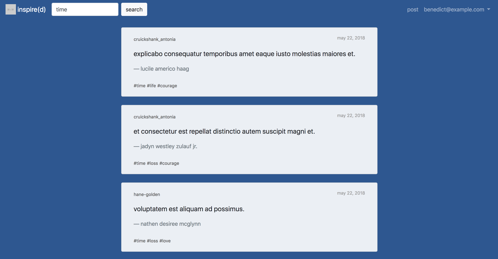
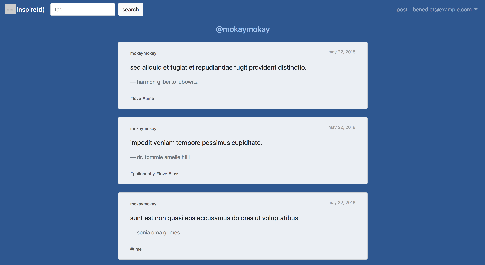

# inspire(d)
## Blogging app for sharing inspirational quotes

## Built with:
* Sinatra
* PostgreSQL

## Demo login:
* Username: kay@example.com
* Password: password

## Screenshots:
Landing page:

Search by tag:

Sample blog:

## Features:
* Users can browse posts without logging in
* Users can sign up for an account and delete their accounts at any time
* Users can add, read, edit, or delete their own posts
* Users can search posts by tag
* Posts are displayed in chronological order (most recent posts are shown first)

## Acknowledgements:
* Inspiration: [Tumblr](https://www.tumblr.com)
